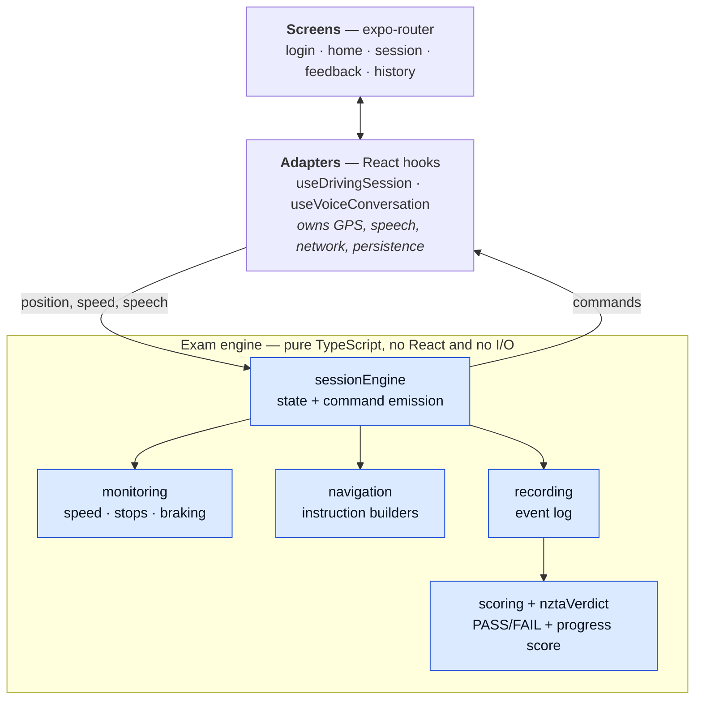
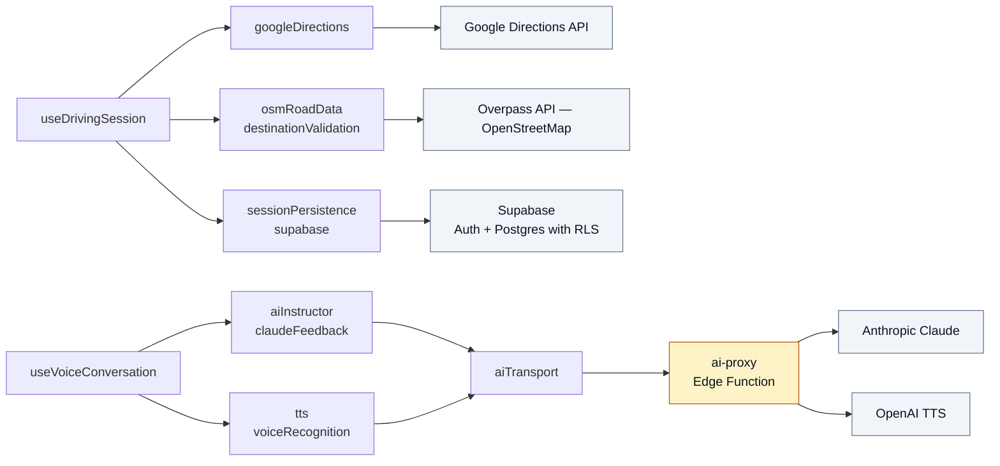
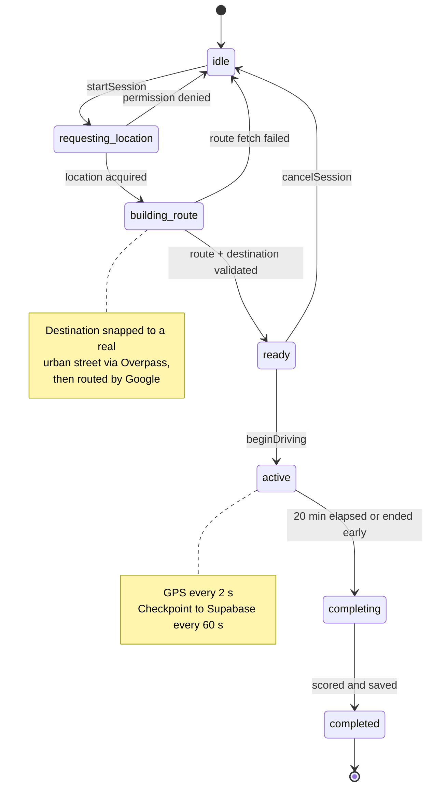
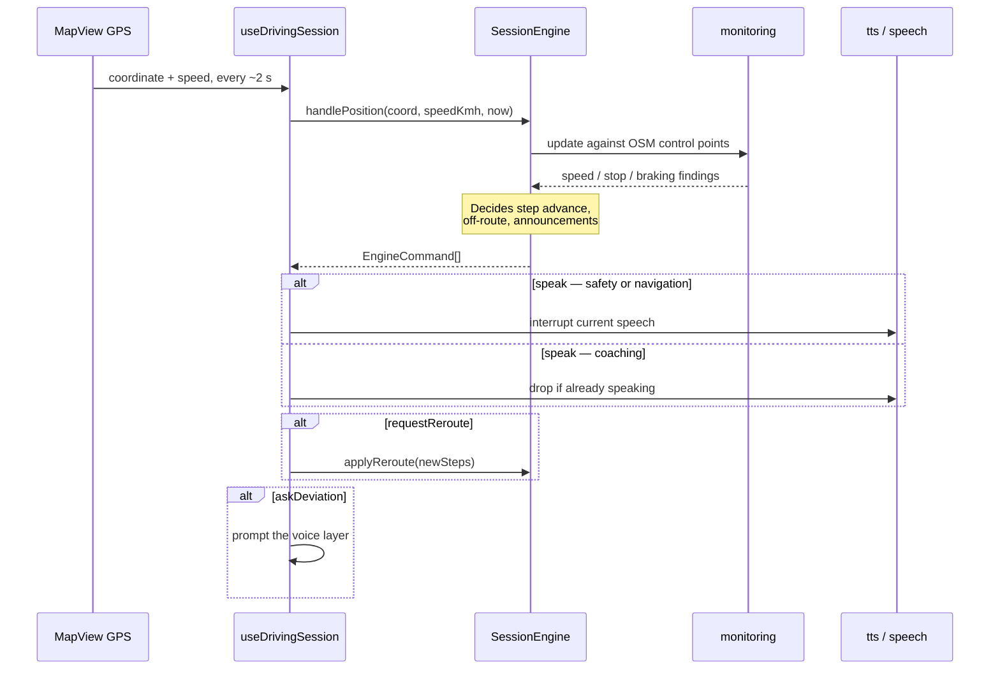
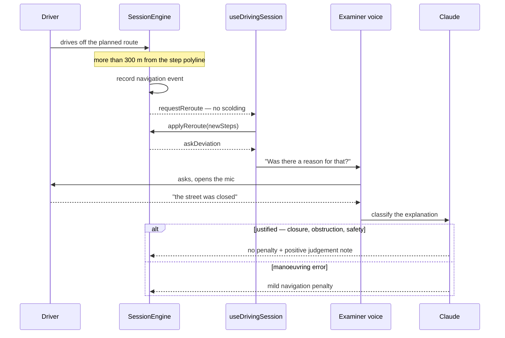
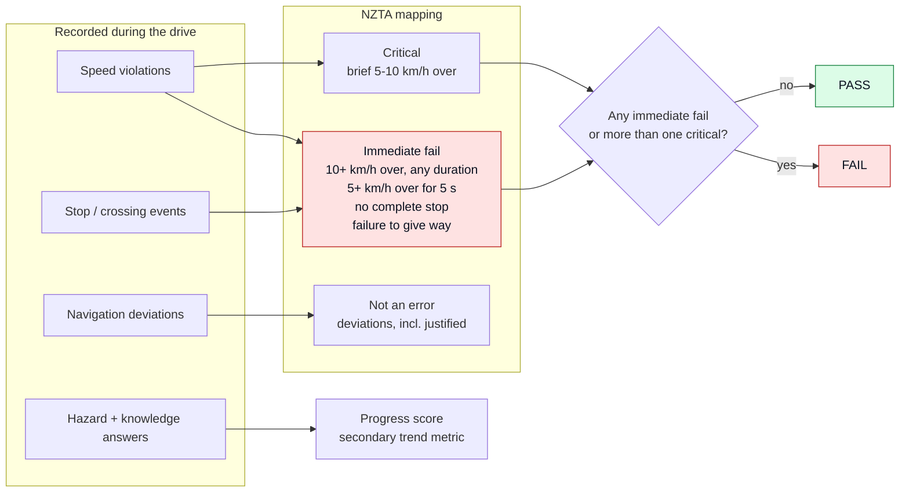

# NZ Drive Practice

[](https://github.com/Elibabah/nz-drive-test/actions/workflows/ci.yml)

**A New Zealand driving examiner in your pocket.** Mount the phone, start a session, and for 20 minutes an AI examiner directs you along a real route generated from your live location, quizzes you on hazards and road rules, silently re-routes when you deviate, and finishes with a verdict aligned to the official NZ Full Licence assessment.

The phone is never touched during a session — everything is voice.

> This repo doubles as an AI-driven-engineering work sample: every load-bearing decision has an [ADR](docs/adr/), the exam logic is a pure module with deterministic replay tests, and CI runs typecheck + 254 tests on every push.

---

## How it works

The exam logic is a **pure, dependency-free TypeScript engine** ([ADR-0006](docs/adr/0006-pure-session-engine.md)). It has no React, no Expo, no globals and no clocks — timestamps are injected, so a session replays deterministically. The React hook around it is a thin adapter that owns every side effect.



The adapters are the only layer that touches the outside world:



**No provider keys ship in the app.** Every AI and TTS call goes through the `ai-proxy` Edge Function ([ADR-0001](docs/adr/0001-api-keys-behind-edge-function-proxy.md)): the client authenticates with the user's Supabase JWT, the server holds the keys and enforces a model allowlist.

---

## Session lifecycle



A crash at minute 18 loses at most one minute: the full session state is checkpointed every 60 seconds with idempotent upserts.

---

## The examiner loop

Position updates drive everything. The engine consumes a coordinate and returns **commands**; the adapter executes them. That boundary is what makes the exam logic testable without a device.



Road data is real, not guessed: at route build the app prefetches an Overpass corridor ([ADR-0004](docs/adr/0004-osm-as-road-data-source.md)) with speed-limit zones, stop signs, traffic signals, give-way and crossings, evaluated by GPS proximity. Traffic signals suppress the unexpected-stop and harsh-braking nudges, so queueing at a red light is not treated as a fault.

---

## Deviation evaluation

Getting lost is not a fail on the real test — disobeying signs is. So a deviation triggers a **silent** reroute, and only afterwards does the examiner ask why.



If the AI is unreachable the fallback is `manoeuvring_error`, which matches the pre-existing behaviour — offline sessions lose nothing.

---

## From events to a verdict

The headline result is a PASS/FAIL modelled on the official NZTA error categories ([ADR-0005](docs/adr/0005-nzta-aligned-scoring.md)), with the numeric score kept only as a secondary trend metric. The full sourced mapping lives in [docs/nzta-error-mapping.md](docs/nzta-error-mapping.md).



The verdict states what it did **not** assess — mirror and head checks, signalling, lane position, vehicle control — so it is never mistaken for a complete assessment.

---

## Code layout

| Path | Responsibility |
|---|---|
| `src/engine/` | Pure exam logic: state machine, monitoring, navigation, recording, scoring, NZTA verdict. No React, no I/O. |
| `src/hooks/` | Adapters: device APIs and React state (`useDrivingSession`), examiner conversation (`useVoiceConversation`). |
| `src/services/` | Network and device integrations: routing, OSM, AI transport, speech, persistence. |
| `app/` | Screens, file-routed with expo-router. |
| `supabase/` | `schema.sql` (re-runnable) and the `ai-proxy` Edge Function. |
| `docs/` | [Roadmap](docs/ROADMAP.md), [ADRs](docs/adr/), [NZTA error mapping](docs/nzta-error-mapping.md). |

---

## Stack

React Native + Expo SDK 54 · TypeScript · expo-router · react-native-maps · expo-speech-recognition · Supabase (Auth, Postgres with per-operation RLS, Edge Functions) · Claude (examiner + evaluation + debrief) · OpenAI TTS · Google Directions · OpenStreetMap via Overpass.

## Running it

`expo-speech-recognition` is a native module, so the app cannot run in Expo Go — you need a development build.

```bash
npm install
npx expo run:ios     # native build (required the first time)
npx expo start --clear   # JS-only changes afterwards
npm test             # 16 suites, 254 tests
```

Environment variables go in `.env` — see [.env.example](.env.example). Provider keys (`ANTHROPIC_API_KEY`, `OPENAI_API_KEY`) are **server-side only** and live in Supabase Edge Function secrets, never in the bundle.

---

## Status

| MVP | Scope | State |
|---|---|---|
| MVP-0 | Foundations: key proxy, schema v2 + checkpointing, CI | ✅ Complete |
| MVP-1 | A credible exam: pure engine, real road data, deviation evaluation, NZTA verdict, destination validation | ✅ Code complete — two exit criteria pending a real drive |
| MVP-2 | Truly hands-free: continuous listening, background audio, audio-first UI | Next |
| MVP-3 | User tiers: ephemeral guest mode, progress history, privacy surface | Planned |
| MVP-4 | Product quality: Maestro E2E with a GPS replayer, accessibility, telemetry, TestFlight | Planned |

Full detail and exit criteria in the [roadmap](docs/ROADMAP.md).

## Decision log

| ADR | Decision |
|---|---|
| [0001](docs/adr/0001-api-keys-behind-edge-function-proxy.md) | All AI provider calls proxied through Supabase Edge Functions |
| [0002](docs/adr/0002-guest-tier-is-ephemeral.md) | Guest tier is ephemeral — nothing persisted |
| [0003](docs/adr/0003-audio-duplex-strategy.md) | Continuous STT vs half-duplex — pending spike |
| [0004](docs/adr/0004-osm-as-road-data-source.md) | OSM/Overpass as the source of speed limits and control points |
| [0005](docs/adr/0005-nzta-aligned-scoring.md) | Scoring modelled on official NZTA error categories |
| [0006](docs/adr/0006-pure-session-engine.md) | Exam logic extracted to a pure TS engine with deterministic replay |
